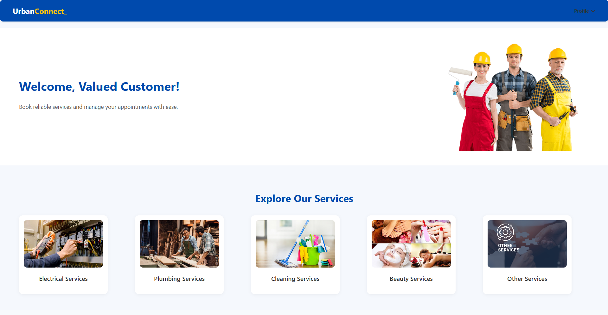
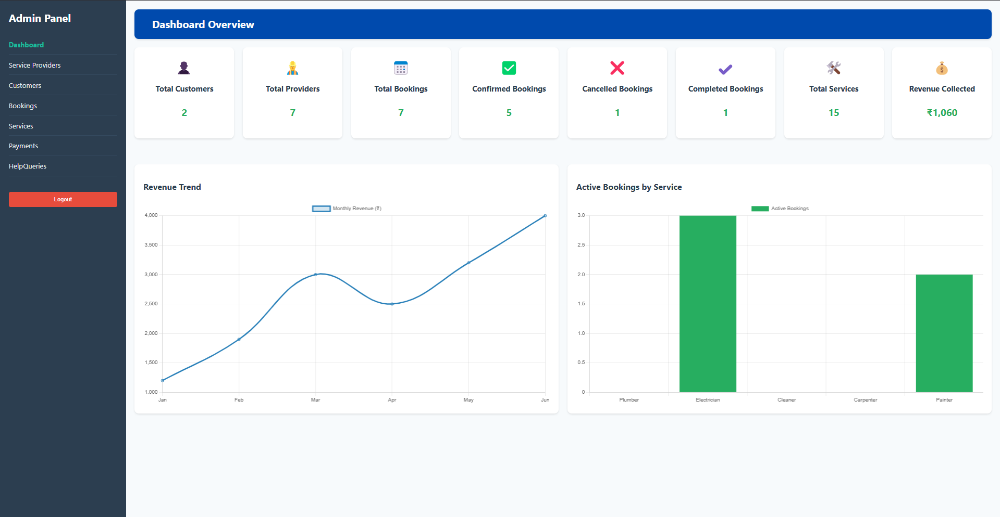

# Urban-Connect: A One-Stop Service Booking and Management Solution

Urban-Connect is a SaaS-based web application designed to streamline the process of booking and managing home services in urban areas. The platform connects customers with verified service providers, enabling seamless service discovery, booking, communication, and issue resolution — all under one roof.

## 🚀 Project Overview

Urban-Connect addresses the inefficiencies of the traditional home services industry by offering a centralized platform where:

- Customers can browse, book, and track services.
- Independent service providers can manage bookings and interact with clients.
- Administrators can oversee the entire ecosystem and ensure service quality.

This solution is built using modern web technologies including **ReactJS**, **Spring Boot**, and **MySQL**, providing a robust, scalable, and user-friendly experience.

---

## ✨ Features

### 👤 Customer
- User Registration and Authentication
- Personalized Customer Dashboard
- Browse and Search for Home Services
- Book Services with Date/Time and Location
- In-App Chat with Service Providers
- View Booking History and Status
- Raise Disputes through Help Desk

### 🧑‍🔧 Service Provider
- Service Provider Registration and Login
- Admin Approval Workflow
- Manage Incoming Bookings
- View Customer Details and Location
- Real-time Messaging with Customers
- Service History Dashboard

### 🛠️ Admin
- Full Access and Control over the System
- Approve/Reject Service Provider Requests
- View and Manage All Users and Bookings
- Dispute Management
- Platform Analytics (optional enhancements)

---

## 🛠️ Tech Stack

| Layer         | Technology Used          |
|---------------|--------------------------|
| **Frontend**  | ReactJS                  |
| **Backend**   | Spring Boot (Java)       |
| **Database**  | MySQL                    |
| **API Testing** | Postman                |
| **Version Control** | Git, GitHub         |

---

## 📷 Screenshots

### Customer Dashboard
 
### Admin Panel

## 👥 Contributors

- [SAI MOURYA N DODDAMANI](https://github.com/Saimourya1751600)

- [SANATH SHETTY](https://github.com/sanathshetty777)

- [SHASHANK R PATIL](https://github.com/shashankpatil92003)

- [VIDHAAN VISWAS](https://github.com/vidhaanviswas)

Special thanks to our OOAD course instructors.

----

## 📜 License
This project is licensed under the MIT License.

